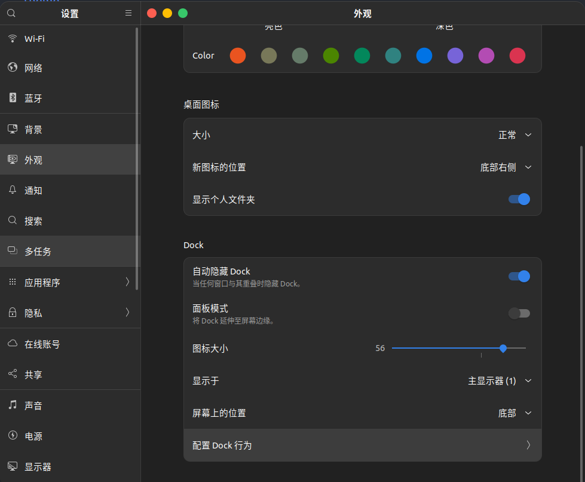
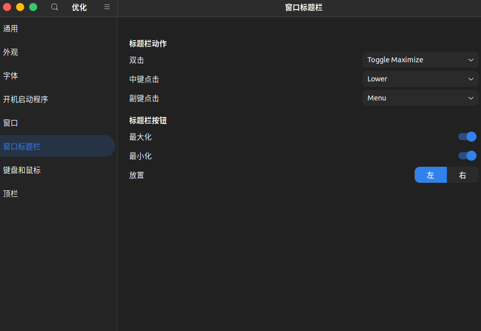
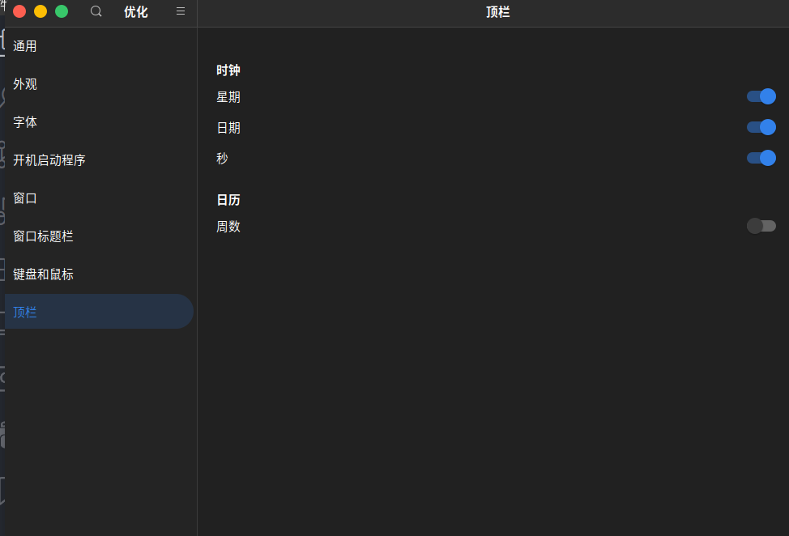

# Ubuntu美化

## 环境

`Ubuntu`版本：`Ubuntu 22.04.4LTS`  
`Gnome`版本：`42.9`

## 开始

1. 更新镜像源

    ```shell
    sudo apt-get update
    ```

2. 安装工具  
    安装应用程序：`tweaks`(优化),扩展程序

    ```shell
    sudo apt-get install gnome-tweaks
    sudo apt-get install gnome-shell-extensions
    ```

    安装浏览器扩展`gnome-shell-integration`。图标是一个脚丫  
    
3. 安装拓展工具  
    在该网页[https://extensions.gnome.org/](https://extensions.gnome.org/)中安装工具，会自动安装到之前安装的拓展程序中。  
    需要的插件`User Themes`, `Net Speed`
4. 下载主题  
    推荐网站：[https://www.gnome-look.org/]( https://www.gnome-look.org/)  
    推荐主题：`Orchis gtk theme`。该主题`github`地址[https://github.com/vinceliuice/Orchis-theme](https://github.com/vinceliuice/Orchis-theme)  
    拉取主题源代码`git clone https://github.com/vinceliuice/Orchis-theme.git`
5. 安装主题
    进入主题目录.执行安装脚本

    ```shell
    cd Orchis-theme
    ./install --tweaks macos
    ```

6. Dock设置  
    进入设置->外观->Dock 参考设置如图  
      
    设置 配置Dock行为  
    
7. 扩展设置  
    在所有程序中搜索`tweaks`或者搜索优化。打开软件  
    外观，参考设置  
    
    窗口标题栏，参考设置  
      
    顶栏，参考设置
    
8. 窗口展示与隐藏动画  
    `gnome`插件官网中搜索`Compiz alike magic lamp effect`插件并点击安装。  
    `Ubuntu`的`Dock`默认只能点击展开，不能点击隐藏窗口，可在命令行执行如下命令开启点击隐藏:

    ```shell
    gsettings set org.gnome.shell.extensions.dash-to-dock click-action 'minimize'
    ```

## 效果展示

1. 打开关闭动画  

2. 桌面预览  


## 恢复

大部分主题卸载方法会在其github中给出，或者运行`./install -h`查看。比较常见的是直接运行

```shell
./install --remove
./install --uninstall
```

当桌面被搞的乱七八糟，可以运行`dconf reset -f /org/gnome/`。此命令可能导致输入法无法使用，需要设置里重新设置输入法。  
可能还有一些比较固执的主题效果无法还原，运行下面的指令：

```shell
sudo aptitude reinstall `dpkg -S /usr/share/icons | cut -d: -f1 | sed 's/,//g'`
sudo aptitude reinstall `dpkg -S /etc/X11/cursors | cut -d: -f1 | sed 's/,//g'`
```
